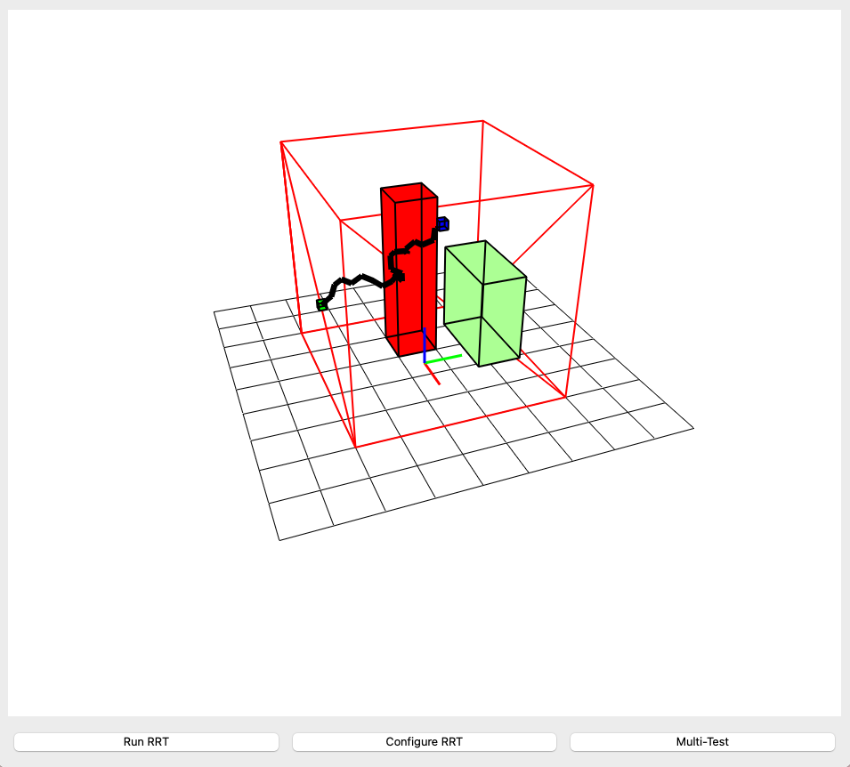
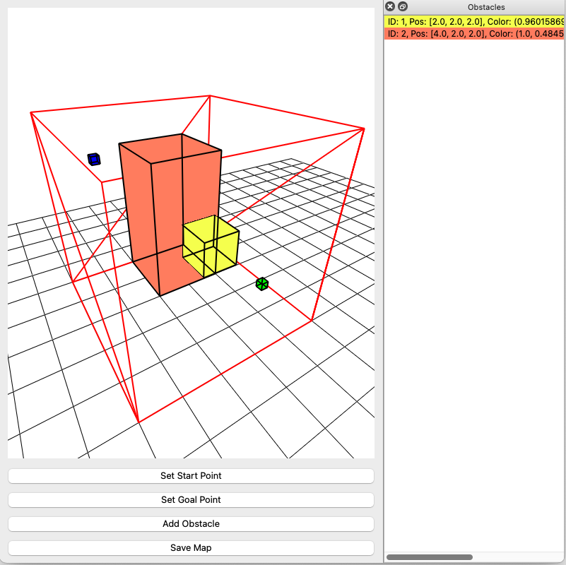

# RRT Trajectory Planner 3D

The RRT Trajectory Planner 3D is a Python application built using PyQtGraph and OpenGL that demonstrates the Rapidly-exploring Random Tree (RRT) algorithm for pathfinding in a 3D environment.  The application allows you to visualize the RRT algorithm's process of finding a path between a start and goal point while avoiding obstacles.  You can customize the environment, including obstacles, start/goal positions, and various RRT algorithm parameters.

## Main Features

*   **3D Visualization:**  View the RRT algorithm's progress in a dynamic 3D environment.
*   **Map Editor:** Define the size, start and finish positions and add obstacles easily with the help of a PyQt interface.
*   **Save/Load maps:** Save the maps made in the **Map Editor** and use them for the RRT algorithm.
*   **Obstacle Creation:**  Define obstacles of varying sizes, positions and colors within the environment.
*   **Customizable RRT Parameters:**  Adjust settings such as safe distance, goal distance, node distance, and the maximum number of nodes.
*   **Quadrant-Based Sampling:**  Enable quadrant-based sampling to bias node generation towards the goal.
*   **Trajectory Display:**  Visualize the final path found by the RRT algorithm.
*   **Interactive Environment:**  Rotate and zoom the 3D view to examine the path and environment.
* **Testing Mode:** Run the algorithm multiple times and see the created amount of waypoints.

## Screenshots

<div>
  
  
</div>

## Installation

This project uses NumPy, PyQt5, PyQtGraph, PyOpenGL, PyOpenGL-accelerate.  To install and run it, follow these steps:

1.  **Ensure you have Python 3 installed.** (Python 3.7 or later is recommended).
2.  **Clone this repository.**
3.  **Install the dependencies:**
  ```bash
    pip3 install -r requirements.txt
  ```
  It is highly recommended to use a virtual environment.
  Create a virtual enviroment with `python -m venv [venv]`
  Activate the enviroment:
  * Windows: `.\env\Scripts\activate`
  * Linux/macOS: `source env/bin/activate`

4.  **Run the application:**
  ```bash
  python3 main.py
  ```

## Usage
* **Running The App:**
    To run the application execute `python3 main.py`.
    You should see a 3D environment when the RRT algorithm has finished.
* **Interacting with the 3D View:**
    - **Rotate:**  Left-click and drag.
    - **Zoom:**  Right-click and drag, or use the mouse wheel.
    - **Pan:**  Middle-click and drag (or Shift + Left-click and drag).
* **Adding custom settings**
To change the look of the environment, edit the *EnvSettings* object in the main file, see the code for more information.
    * **grid:** Enable/Disable the grid.
    * **startColor:** Define the color of the start cube.
    * **goalColor:** Define the color of the goal cube.
    * **obstacleColor:** Defines the default colour of the obstacle cubes, you can also define the colour of each obstacle independently.
    * **boundary:** Enable/Disable the boundry.

  To change the RRT algorithm, edit the *RRTSettings* object in the main file, see the code for more information.
    * **safeDistance:** Define the safe distance from the obstacles.
    * **goalDistance:** Define the minimum distance from the goal to consider the algorithm as finished.
    * **nodeDistance:** Maximum distance between created nodes.
    * **nodeLimit:** Limit of nodes that the algorithm will create.
    * **quadrants:** Enable/Disable quadrants division
    * **numQuadrantsPerAxis:** Number of quadrants per axis, only available if *quadrants* is enabled.
    * **quadrantProb:** Probability of creating a node inside the goal quadrant.

* **Running The Map Editor:**
    To run the Map Editor execute `python3 map_editor.py`.
    * Define the size of the map.
    * Define the start and goal positions.
    * Define the obstacles. 
    * Save the map on the `./maps` folder.

* **Running Test Mode**
If you want to generate multiple RRT in a row, use the *search* method located in the main file.
To do so, edit the *nTest* parameter to a value higher than 0. This value will be the amount of RRT algorithms generated.
The number of nodes of each generation will be stored in the testLog.log file, located in the root folder.

## Coordinate System

**Important:** This application uses a *non-standard* coordinate system for easier conceptualization within the context of the project. The coordinate system is defined as follows:

*   **X:** Horizontal (Left/Right)
*   **Y:** Depth (Front/Back / Into/Out of the screen)
*   **Z:** Vertical (Up/Down)

## License

This project is under the MIT License. See the [LICENSE](LICENSE) file for details.
